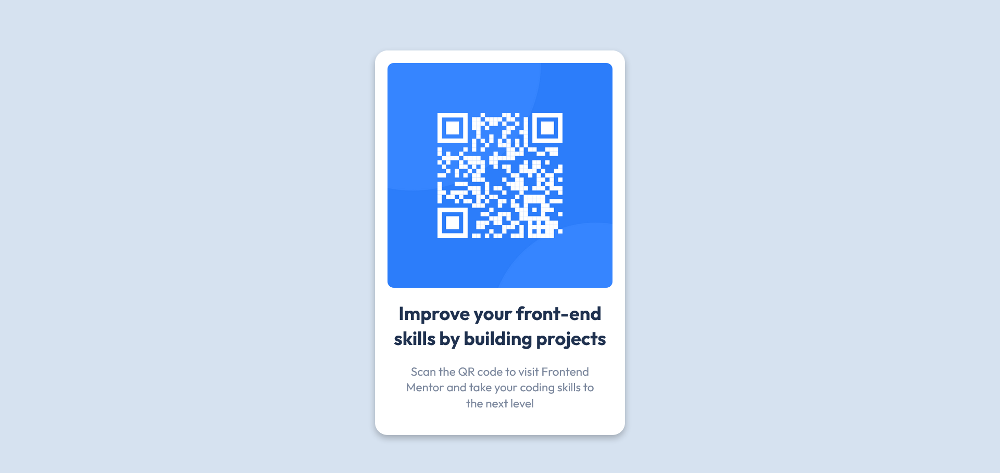

# Frontend Mentor - QR code component solution

This is a solution to the [QR code component challenge on Frontend Mentor](https://www.frontendmentor.io/challenges/qr-code-component-iux_sIO_H). Frontend Mentor challenges help you improve your coding skills by building realistic projects. 

## Table of contents

- [Overview](#overview)
  - [Screenshot](#screenshot)
  - [Links](#links)
- [My process](#my-process)
  - [Built with](#built-with)
  - [What I learned](#what-i-learned)
  - [Continued development](#continued-development)
  - [Useful resources](#useful-resources)
- [Author](#author)
- [Acknowledgments](#acknowledgments)

**Note: Delete this note and update the table of contents based on what sections you keep.**

## Overview

### Screenshot

### Links

- Solution URL: [Add solution URL here](https://codepen.io/kinlearn/pen/yLWjmoQ)
- Live Site URL: [The solution is live on CodePen 🖊️](https://codepen.io/kinlearn/pen/yLWjmoQ)

## My process

### Built with

- Semantic HTML5 markup
- CSS custom properties
- Flexbox

### What I learned

Even though the project was very simple and small, it definitely taught me some things. Here are some things I learnt from this project:
1. Be aware while applying margin properties
2. Applying `width : 100vw;` to body causes scrollbar.
3. Even small projects may take more time than we tend to estimate.

### Continued development

I am going to continue learning CSS in more depth, especially new properties like `block-width` etc. and going to focus more on responsive width properties. Flexbox, functions like `filter()` will be on my radar now.

### Useful resources

- [ChatGPT](https://www.chatgpt.com) - It's the ultimate debugger especially when there are time constraints.

- [MDN](https://developer.mozilla.org/en-US/) - Very helpful when I get confused or not sure about certain properties and rules.

- [Stack Overflow](https://stackoverflow.com/) - I took help from here when my body got a scrollbar. 

## Author

- Website - [Ajinkya Kinhikar](https://www.kinhikar.com)
- Frontend Mentor - [@kinlearn](https://www.frontendmentor.io/profile/kinlearn)
- Twitter - [@KinLearns](https://www.x.com/KinLearns)

## Acknowledgments

Thanks to Fronend Mentor, GitHub, Netlify, CodePen, and all the amazing teachers out there for providing me an opportunity to learn and practice the skills completely freely! Thank you so much everyone! 
